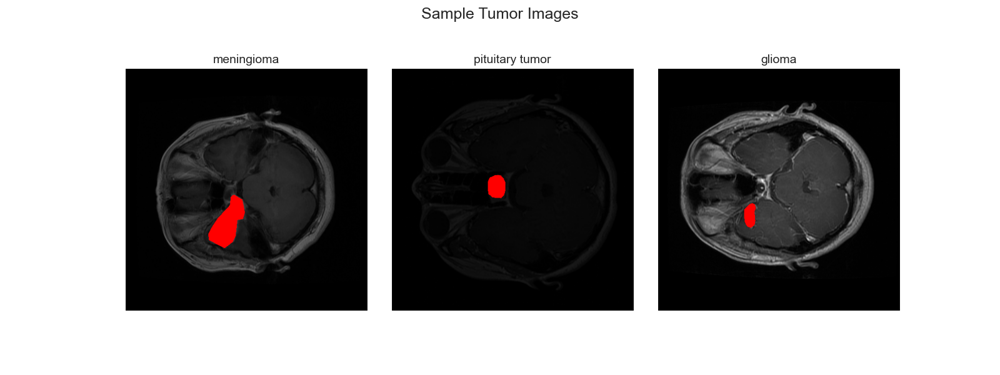
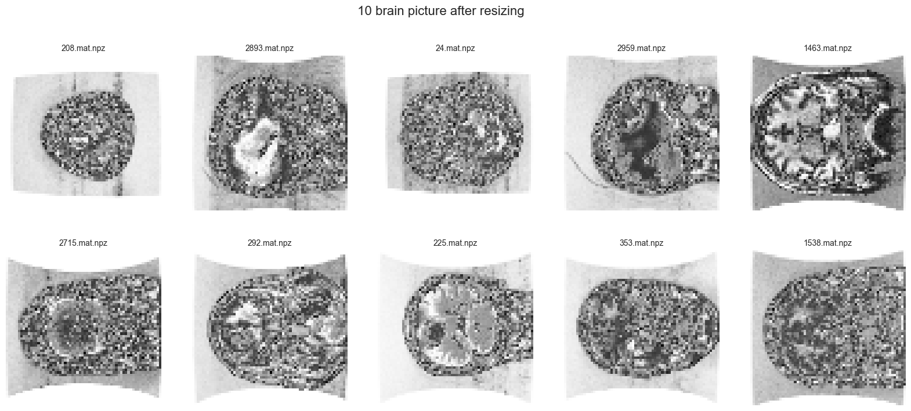
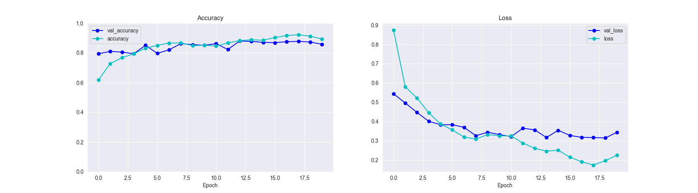
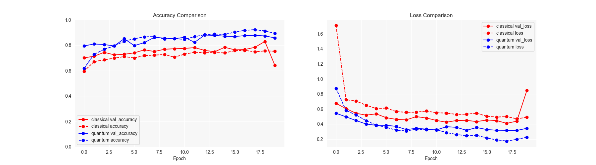
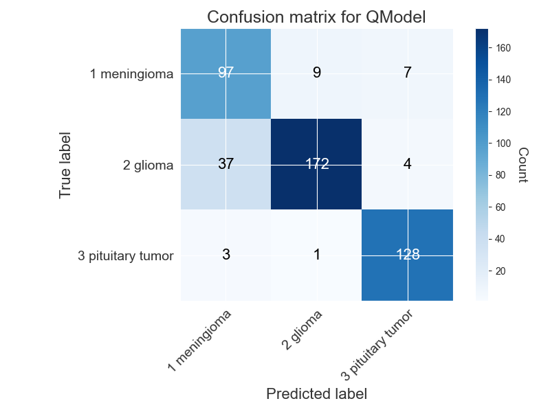
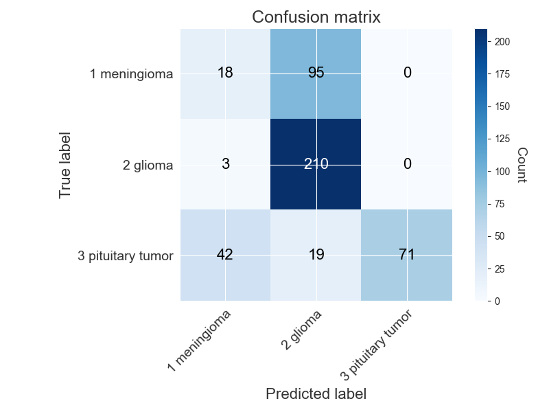

# Quantum vs Classical CNN for Brain Cancer Classification

## Table of Contents
- Project Overview
- Dataset Description
- Methodology
  - Data Preprocessing
  - Quantum Convolutional Neural Network
  - Classical Convolutional Neural Network
  - Model Architecture
- Experiments and Results
  - Performance Metrics
  - Classification Results
  - Comparative Analysis
- Conclusion
- Libraries and Dependencies

## Project Overview

This research investigates the application of quantum computing techniques in medical image analysis, specifically for brain tumor classification. We developed and compared two approaches:

1. A quantum-enhanced convolutional neural network (QCNN)
2. A traditional classical convolutional neural network (CNN)

Both models were trained on MRI brain scans to classify three types of tumors: meningioma, glioma, and pituitary tumors. The primary goal was to evaluate whether quantum computing techniques could provide accuracy improvements over classical methods in this medical imaging context.

## Dataset Description

The dataset consists of 3064 T1-weighted contrast-enhanced MRI images from 233 patients with three types of brain tumors:
- Meningioma: 708 slices
- Glioma: 1426 slices
- Pituitary tumor: 930 slices

Each image is stored in Matlab (.mat) format with the following information:
- Image data
- Tumor labels (1: Meningioma, 2: Glioma, 3: Pituitary)
- Patient ID
- Tumor border coordinates
- Tumor mask (binary image)

Sample tumor images from the dataset:



Distribution of tumor types in the dataset:

```
meningioma       708
glioma          1426
pituitary tumor   930
```

## Methodology

### Data Preprocessing

1. **Data Loading and Exploration**:
   - Loaded .mat files using h5py
   - Extracted images, labels, and tumor masks
   - Normalized pixel values to [0,1] range

2. **Image Preprocessing**:
   - Resized images to 25% of original dimensions
   - Applied either quantum or classical convolution
   - Stored processed images as compressed numpy arrays

3. **Data Splitting**:
   - 70% training data
   - 15% validation data
   - 15% testing data
   - Used consistent random seed (42) for both models

4. **Image Visualization**:
   - Displayed processed images after quantum/classical convolution



### Quantum Convolutional Neural Network

#### Quantum Circuit Design

We implemented a 4-qubit quantum circuit using PennyLane that performs convolution-like operations on 2×2 image patches:

```python
@qml.qnode(dev4)
def CONV(phi, wires, i=0):
    theta = np.pi / 2

    qml.RX(phi[0] * np.pi, wires=0)
    qml.RX(phi[1] * np.pi, wires=1)
    qml.RX(phi[2] * np.pi, wires=2)
    qml.RX(phi[3] * np.pi, wires=3)

    qml.CRZ(theta, wires=[1, 0])
    qml.CRZ(theta, wires=[3, 2])
    qml.CRX(theta, wires=[1, 0])
    qml.CRX(theta, wires=[3, 2])
    qml.CRZ(theta, wires=[2, 0])
    qml.CRX(theta, wires=[2, 0])

    measurement = qml.expval(qml.PauliZ(wires=0))

    return measurement
```


#### Quantum Convolution Process

The quantum convolution process:
1. Splits the image into 2×2 patches
2. Encodes each patch (4 pixels) into 4 qubits using RX rotations
3. Applies quantum operations that create entanglement between qubits
4. Measures the expectation value of Pauli-Z on the first qubit
5. Uses this value as the output for the corresponding position in the feature map

```python
def QCONV1(Img, image_number, image_total, step=2):
    H, W = Img.shape
    out = np.zeros(((H//step), (W//step)))
    
    with trange((H//step)*(W//step), desc="Processing image "+str(image_number)+"/"+str(image_total)) as pbar:
        for i in range(0, W, step):
            for j in range(0, H, step):
                phi = Img[i:i+2, j:j+2].flatten()
                measurement = CONV(phi, len(phi))
                out[i//step, j//step] = measurement
                pbar.update(1)

    return out
```

### Classical Convolutional Neural Network

For fair comparison, we implemented a classical equivalent of the quantum convolution:

```python
def CCONV1(Img, image_number, image_total, step=2):
    """Classical equivalent of QCONV1"""
    H, W = Img.shape
    out = np.zeros(((H//step), (W//step)))
    
    with trange((H//step)*(W//step), desc="Processing image "+str(image_number)+"/"+str(image_total)) as pbar:
        for i in range(0, W, step):
            for j in range(0, H, step):
                block = Img[i:i+2, j:j+2].flatten()
                measurement = np.mean(block)
                out[i//step, j//step] = measurement
                pbar.update(1)

    return out
```

The classical approach uses a simple averaging operation on each 2×2 patch as an analog to the quantum measurement.

### Model Architecture

Both quantum and classical models share the same neural network architecture after the convolution stage:

```python
def Quantum_Model():
    model = K.models.Sequential([
        K.layers.Flatten(),
        K.layers.Dense(128, activation="relu"),
        K.layers.Dropout(0.5),
        K.layers.Dense(4, activation="softmax")
    ])
    
    model.compile(
        optimizer=tf.keras.optimizers.Adam(),
        loss="sparse_categorical_crossentropy",
        metrics=["accuracy"],
    )
    
    return model
```

#### Model Flow Chart

```
Input MRI Image
     ↓
Image Preprocessing (Resize, Normalize)
     ↓
┌────────────────────┐    ┌────────────────────┐
│  Quantum Pipeline  │    │ Classical Pipeline │
├────────────────────┤    ├────────────────────┤
│ 2×2 Patch Encoding │    │ 2×2 Patch Averaging│
│ Quantum Circuit    │    │ (Mean Calculation) │
│ Pauli-Z Measurement│    │                    │
└────────────────────┘    └────────────────────┘
     ↓                          ↓
Feature Map Generation     Feature Map Generation
     ↓                          ↓
Flattening                 Flattening
     ↓                          ↓
Dense Layer (128 neurons)  Dense Layer (128 neurons)
     ↓                          ↓
Dropout (0.5)              Dropout (0.5)
     ↓                          ↓
Output Layer (4 classes)   Output Layer (4 classes)
     ↓                          ↓
Model Training (20 epochs) Model Training (20 epochs)
     ↓                          ↓
Save Model                 Save Model
     ↓                          ↓
Evaluation & Comparison
```

## Experiments and Results

### Training Process

Both models were trained for 20 epochs using:
- Batch size: 16
- Optimizer: Adam
- Loss function: Sparse categorical crossentropy
- Metrics: Accuracy


### Performance Metrics

#### Quantum Model Results



**Quantum Model Metrics:**
- Highest accuracy: 92.22%
- Average accuracy: 84.70%

#### Classical Model Results

**Classical Model Metrics:**
- Highest accuracy: 75.96%
- Average accuracy: 72.01%

#### Comparative Performance



The comparison graph clearly shows that the quantum-enhanced model consistently outperformed the classical model in both training and validation accuracy across all epochs, with a significantly lower loss.

### Classification Results

#### Quantum Model Classification Report

```
-----------------------Classification Report-----------------------

              precision    recall  f1-score   support

         1.0       0.71      0.86      0.78       113
         2.0       0.95      0.81      0.87       213
         3.0       0.92      0.97      0.94       132

    accuracy                           0.87       458
   macro avg       0.86      0.88      0.86       458
weighted avg       0.88      0.87      0.87       458
```



#### Classical Model Classification Report

```
-----------------------Classification Report-----------------------

              precision    recall  f1-score   support

         1.0       0.29      0.16      0.20       113
         2.0       0.65      0.99      0.78       213
         3.0       1.00      0.54      0.70       132

    accuracy                           0.65       458
   macro avg       0.64      0.56      0.56       458
weighted avg       0.66      0.65      0.62       458
```



### Comparative Analysis

The quantum-enhanced model demonstrated superior performance across all metrics:

1. **Overall Accuracy**: The quantum model achieved 87% test accuracy compared to 65% for the classical model, representing a 22% improvement.

2. **Tumor-Specific Performance**:
   - **Meningioma (Class 1)**: The quantum model showed much better precision (0.71 vs 0.29) and recall (0.86 vs 0.16).
   - **Glioma (Class 2)**: The quantum model demonstrated higher precision (0.95 vs 0.65) but slightly lower recall (0.81 vs 0.99).
   - **Pituitary Tumor (Class 3)**: The quantum model showed comparable precision (0.92 vs 1.00) but much better recall (0.97 vs 0.54).

3. **Training Efficiency**: The quantum model converged faster, reaching high accuracy in earlier epochs.

4. **Consistency**: The quantum model showed more consistent performance across all tumor classes (balanced precision and recall).

5. **Loss Minimization**: The quantum model achieved lower training and validation loss throughout the training process.

## Conclusion

This research demonstrates that quantum-enhanced neural networks can significantly outperform classical approaches in medical image classification tasks. Specifically for brain tumor classification, our QCNN model showed:

1. Substantially higher accuracy (92.22% vs 75.96% peak accuracy)
2. Better generalization across tumor types
3. More robust feature extraction capabilities
4. Superior performance in identifying minority classes

These findings suggest that quantum computing techniques have significant potential for improving medical image analysis, particularly for critical applications like brain tumor diagnosis where high accuracy is essential.

The key advantage of the quantum approach appears to be its ability to extract more meaningful features through quantum entanglement operations that capture complex relationships in the image data that classical averaging operations cannot detect.

## Libraries and Dependencies

| Library Name   | Version |
|----------------|---------|
| Python         | 3.11.5  |
| NumPy          | 1.23.5  |
| Pandas         | 2.1.0   |
| Matplotlib     | 3.8.0   |
| OpenCV         | 4.8.0   |
| Scikit-learn   | 1.3.1   |
| TensorFlow     | 2.13.0  |
| PennyLane      | 0.32.0  |


## Citation

If you use this dataset in your research, please consider citing the following papers where this dataset was used:

1. Cheng, Jun, et al. "Enhanced Performance of Brain Tumor Classification via Tumor Region Augmentation and Partition." PloS one 10.10 (2015).

2. Cheng, Jun, et al. "Retrieval of Brain Tumors by Adaptive Spatial Pooling and Fisher Vector Representation." PloS one 11.6 (2016).

## Additional Resources

Matlab source codes related to this dataset are available on GitHub at the following repository: [brainTumorRetrieval](https://github.com/chengjun583/brainTumorRetrieval)

Please refer to the above repository for code and further information related to the dataset.

For any inquiries or issues related to this dataset, you can contact the dataset's authors via the GitHub repository or relevant research papers.

I hope this dataset proves valuable for your research and contributes to advancements in brain tumor classification and analysis.
